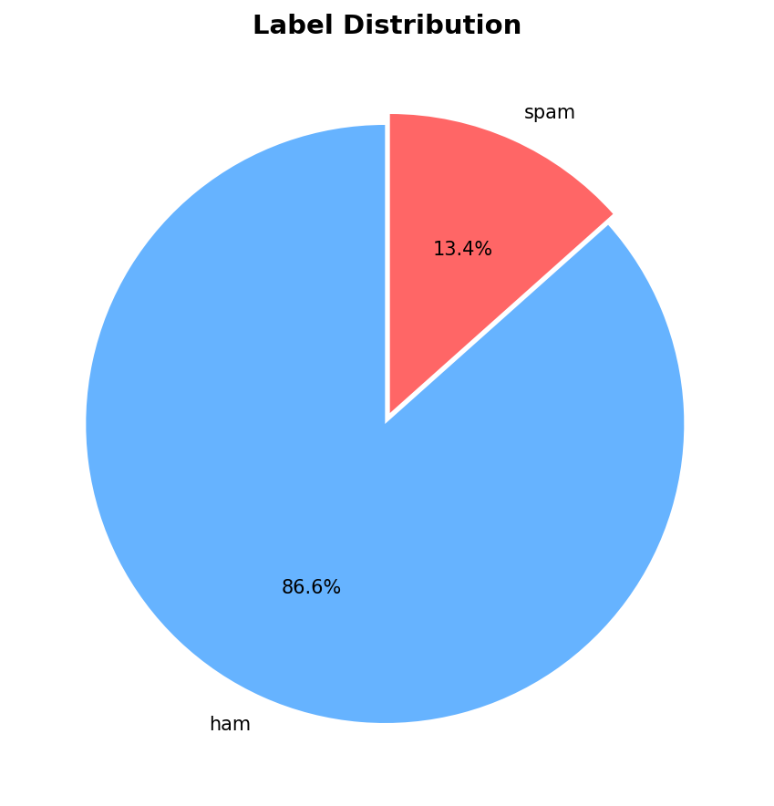
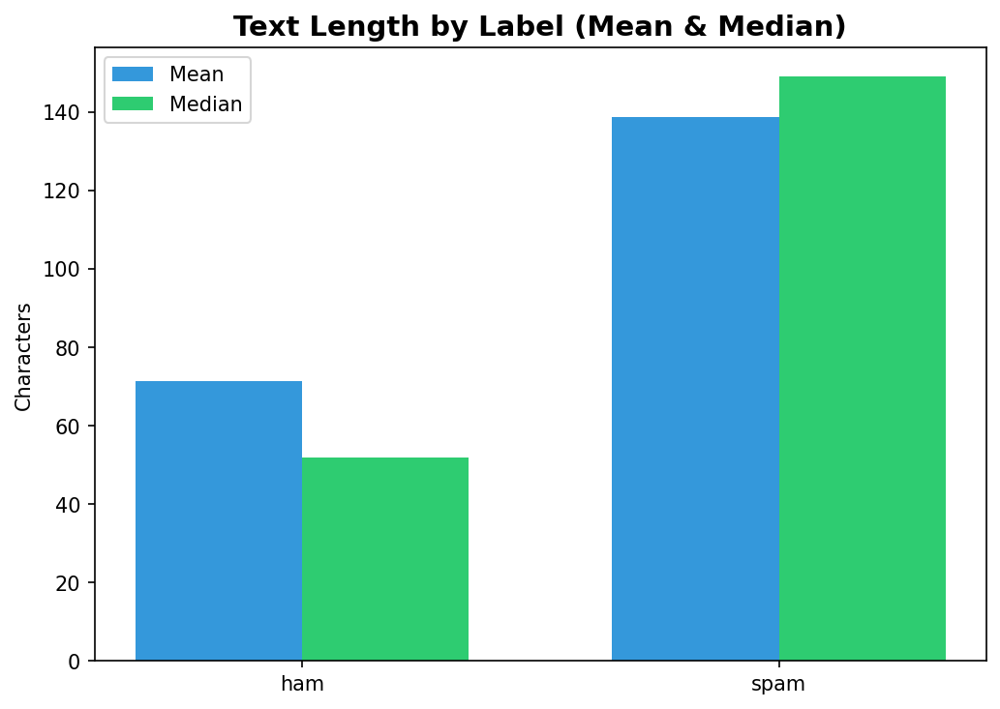
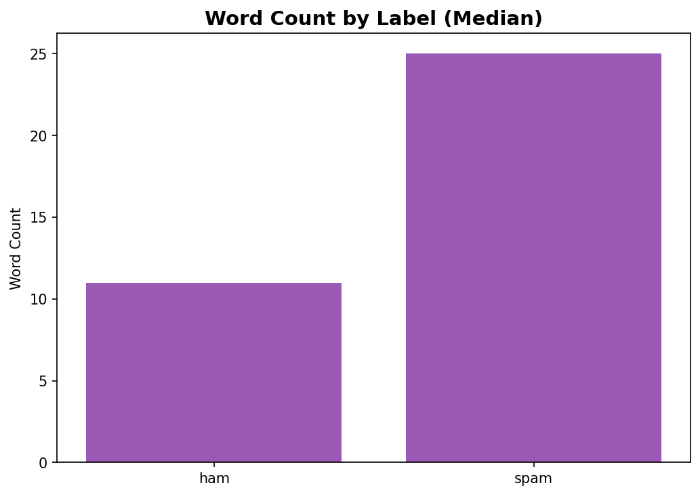
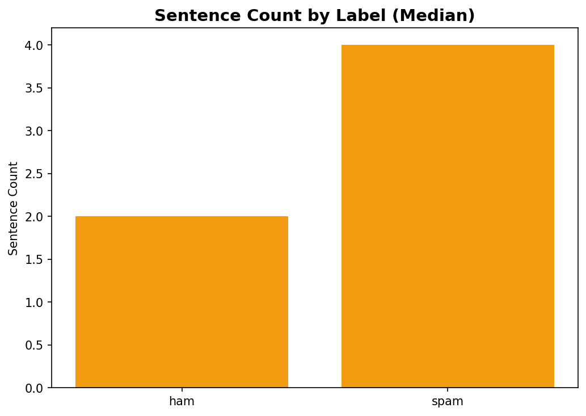
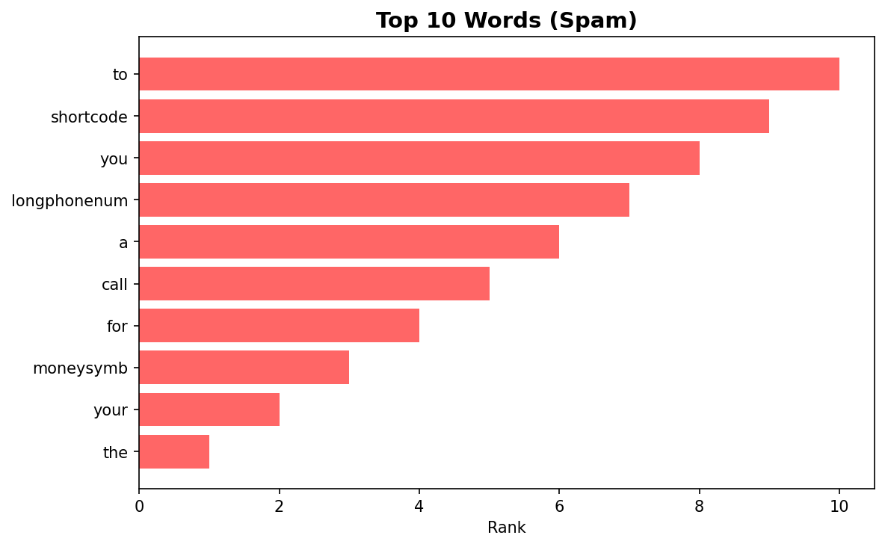
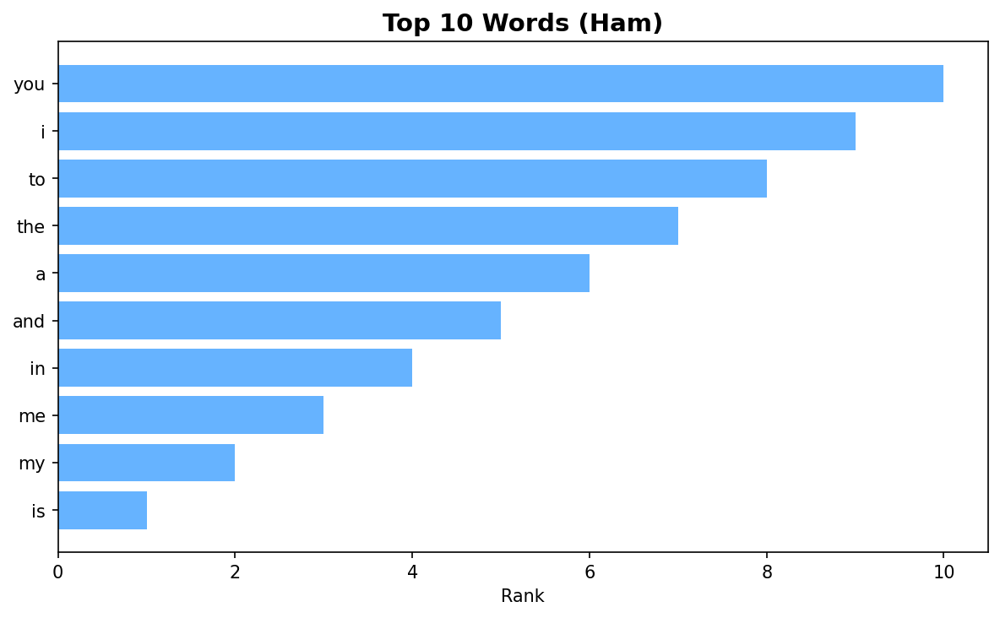
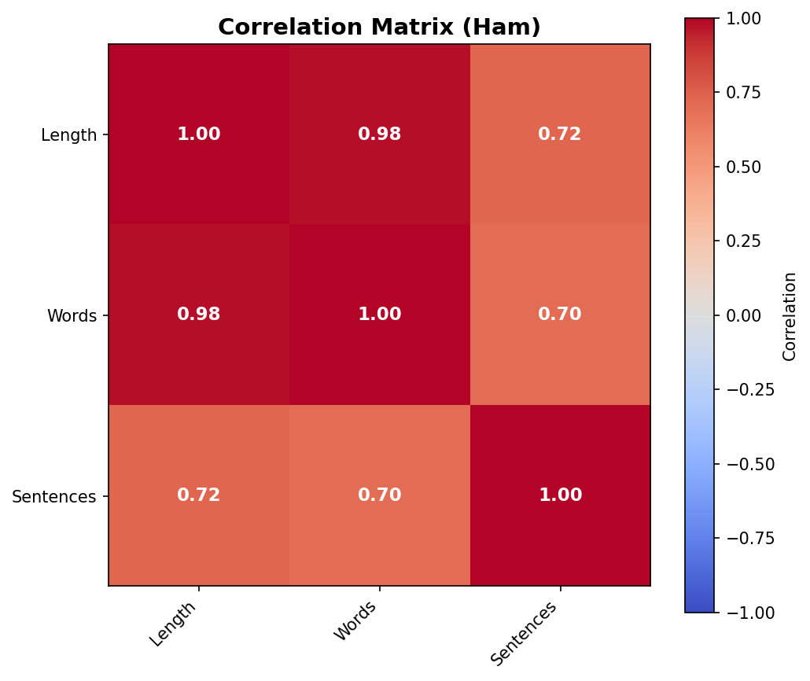
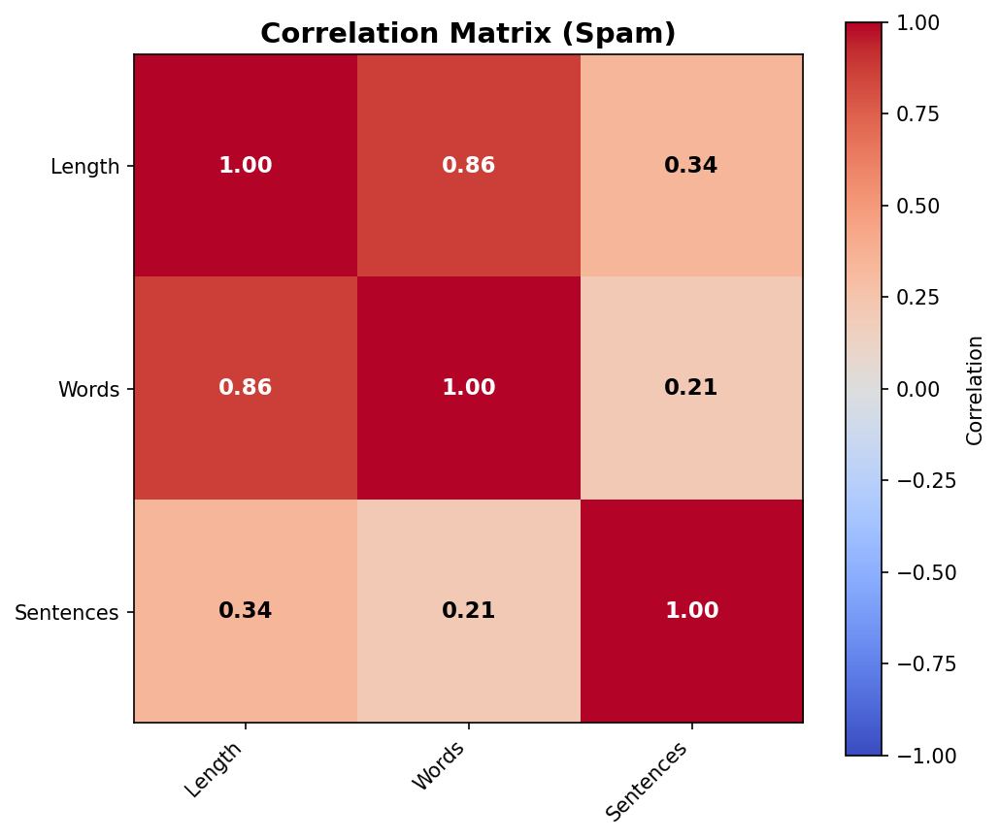

# SMS Spam Analysis Package

analysis of the SMS dataset to understand the characteristics of spam vs. ham  messages. 

## Dataset Overview

- **Total messages**: 5,572
- **Ham (legitimate)**: 4,825 (86.6%)
- **Spam**: 747 (13.4%)

---

## Individual Analysis Scripts

Each script runs a specific analysis and outputs results to the console.

| Script | Description | Key Output |
|--------|-------------|------------|
| `distribution.py` | Counts spam vs ham messages | Label counts and percentages |
| `sms_length.py` | Character count statistics | Mean & median characters by label |
| `sms_word_count.py` | Word count analysis | Median words per message by label |
| `sms_sentence_count.py` | Sentence count analysis | Median sentences per message by label |
| `word_analysis.py` | Top words (with stopwords) | Top 20 words for all/spam/ham |
| `word_analysis_stop.py` | Top words (no stopwords) | Top 20 meaningful words by label |
| `ngrams.py` | Bigrams & trigrams analysis | Top n-grams for spam vs ham |
| `correlation.py` | Feature correlation matrix | Correlation between length, words, sentences |

### Running Individual Analyses

```bash
# Label distribution
make distribution

# SMS length analysis
make sms-length

# Word count analysis
make word-count

# Sentence count analysis
make sentence-count

# Word frequency (with stopwords)
make word-analysis

# Word frequency (without stopwords)
make word-analysis-stop

# N-gram analysis
make ngrams

# Correlation analysis
make correlation
```

Or directly:
```bash
python -m analysis.distribution
python -m analysis.sms_length
python -m analysis.sms_word_count
python -m analysis.sms_sentence_count
python -m analysis.word_analysis
python -m analysis.word_analysis_stop
python -m analysis.ngrams
python -m analysis.correlation
```

---

## Visual Reports

### Combined Report (`report_analysis.py`)

Generates a single figure with 9 subplots showing all visualizations.

```bash
make report-analysis
# or
python -m analysis.report_analysis
```

### Individual Images (`report_images.py`)

Generates separate PNG files for each chart.

```bash
make report-images
# or
python -m analysis.report_images
```

Images are saved to: `analysis/img/`

---

## Report Figures - Detailed Explanation

### Figure 1: Label Distribution
{ width=500 }

| Metric | Value |
|--------|-------|
| Ham | 4,825 (86.6%) |
| Spam | 747 (13.4%) |

**What it shows**: The class imbalance in the dataset, ham messages outnumber spam by ~6.5:1.

**Key Insight**: This imbalance is important, accuracy alone can be misleading. A model that always predicts "ham" would achieve 86.6% accuracy.

**Conclusion**: Use metrics like precision, recall, and F1-score rather than accuracy to evaluate model performance.

---

### Figure 2: Text Length by Label
{ width=500 }

| Label | Mean | Median |
|-------|------|--------|
| Ham | 71.5 chars | 52.0 chars |
| Spam | 138.7 chars | 149.0 chars |

**What it shows**: Spam messages are significantly longer than ham messages.

**Key Insight**: 
- Spam has nearly **2x the median length** (149 vs 52 characters)
- The large gap between mean and median for ham (71.5 vs 52) suggests some very long ham messages pull up the average

**Conclusion**: Text length is a strong discriminative feature, shorter messages are more likely to be legitimate.

---

### Figure 3: Word Count by Label
{ width=500 }

| Label | Median Words |
|-------|--------------|
| Ham | 11 words |
| Spam | 25 words |

**What it shows**: Spam messages contain more than double the words compared to ham.

**Key Insight**: The word count pattern mirrors the character length pattern, spam is consistently longer.

---

### Figure 4: Sentence Count by Label
{ width=500 }

| Label | Median Sentences |
|-------|------------------|
| Ham | 2 sentences |
| Spam | 4 sentences |

**What it shows**: Spam messages tend to have more sentences.

**Key Insight**: Spam messages are more verbose, often containing multiple sentences to convey their "offer."

---

### Figure 5: Top Words (Spam)


**Top 10 Spam Words (no stopwords)**:
1. to
2. shortcode
3. you
4. longphonenum
5. a
6. call
7. for
8. moneysymb
9. your
10. the

**What it shows**: Spam-specific vocabulary including:
- **Urgency indicators**: "call", "shortcode"
- **Monetary symbols**: "moneysymb" (anonymized currency)
- **Contact information**: "longphonenum" (anonymized phone numbers)

**Key Insight**: Anonymized tokens like `shortcode`, `longphonenum`, and `moneysymb` are spam indicators - these represent masked phone numbers, premium SMS shortcodes, and currency amounts.

**Conclusion**: These words are strong spam signals and should be weighted heavily in the model.

---

### Figure 6: Top Words (Ham)


**Top 10 Ham Words (no stopwords)**:
1. you
2. i
3. to
4. the
5. a
6. and
7. in
8. me
9. my
10. is

**What it shows**: Ham vocabulary is dominated by personal pronouns and common words.

**Key Insight**: Legitimate messages are conversational, using first-person pronouns ("I", "me", "my").

**Conclusion**: The contrast between spam and ham word usage is a powerful feature.

---

### Figure 7: Correlation Matrix (Overall)


| | Length | Words | Sentences |
|--|--------|-------|-----------|
| **Length** | 1.000 | 0.974 | 0.713 |
| **Words** | 0.974 | 1.000 | 0.675 |
| **Sentences** | 0.713 | 0.675 | 1.000 |

**What it shows**: How text metrics correlate across all messages.

**Key Insights**:
- **Very strong correlation** between text length and word count (0.974) - expected, more words = more characters
- **Strong correlation** between length and sentences (0.713)
- These features provide overlapping information but still add value together

---

### Figure 8: Correlation Matrix (Ham)


| | Length | Words | Sentences |
|--|--------|-------|-----------|
| **Length** | 1.000 | 0.980 | 0.723 |
| **Words** | 0.980 | 1.000 | 0.700 |
| **Sentences** | 0.723 | 0.700 | 1.000 |

**What it shows**: Correlation patterns for legitimate messages.

**Key Insight**: Ham messages show very consistent relationships - longer texts have proportionally more words and sentences.

**Conclusion**: The tight correlations in ham suggest natural, proportional writing style.

---

### Figure 9: Correlation Matrix (Spam)


| | Length | Words | Sentences |
|--|--------|-------|-----------|
| **Length** | 1.000 | 0.863 | 0.336 |
| **Words** | 0.863 | 1.000 | 0.208 |
| **Sentences** | 0.336 | 0.208 | 1.000 |

**What it shows**: Correlation patterns for spam messages.

**Key Insights**:
- **Weak correlation** between sentences and length/words (0.336, 0.208)
- Spam has **longer sentences** (more words per sentence) compared to ham
- This suggests spam uses a different writing style - more "pitch" language

**Conclusion**: The correlation structure differs significantly between spam and ham.

---

## Key Findings Summary

| Finding | Spam | Ham | Implication |
|---------|------|-----|-------------|
| **Message Length** | 149 chars (median) | 52 chars (median) | Spam is 2-3x longer |
| **Word Count** | 25 words | 11 words | Spam uses more words |
| **Sentences** | 4 sentences | 2 sentences | Spam is more verbose |
| **Key Words** | call, shortcode, moneysymb | you, i, my | Personal vs promotional |
| **Sentence Structure** | Weak correlation (0.21-0.34) | Strong correlation (0.70-0.98) | Different writing patterns |

---

## N-gram Analysis Highlights

### Top Spam Bigrams
- "po box", "1000 cash", "prize guaranteed", "send stop", "urgent mobile"

### Top Spam Trigrams  
- "guaranteed 1000 cash", "draw shows won", "land line claim"

### Top Ham Bigrams
- "ll later", "let know", "sorry ll", "good morning", "good night"

### Top Ham Trigrams
- "sorry ll later", "happy new year", "pls send message"

**Insight**: Spam uses promotional phrases with prizes/money, while ham uses conversational phrases about meetings and greetings.

---

## Usage in ML Pipeline

These insights directly informed the feature engineering in the ML models:

1. **TF-IDF features** - Capture the distinctive vocabulary (spam words vs ham words)
2. **Metadata features** - Character count, word count, uppercase ratio, exclamation marks
3. **N-gram features** - Capture phrase patterns specific to spam (e.g., "prize guaranteed", "call now")

See the [ML README](../ml/README.md) for model training and performance details.
