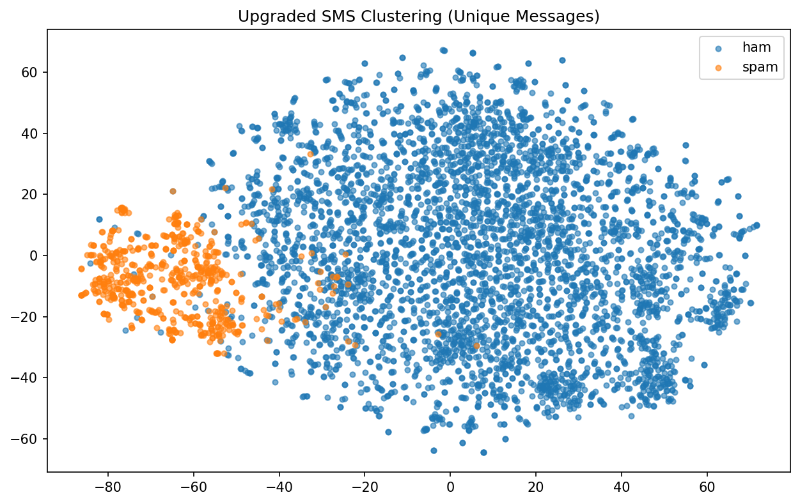

# LLM Module

SMS embeddings + clustering for semantic search and spam detection.

## Embeddings

Embeddings convert text into numerical vectors (lists of numbers) that capture semantic meaning. Similar messages end up close to each other in this numerical space.

**Example:** "You won free money" and "Congratulations prize winner" → similar vectors

## Embeddings

| Model | Dimension | Storage |
|-------|-----------|---------|
| text-embedding-3-small | 1536 | Qdrant |

## Clustering

Clustering groups similar items together without predefined labels. K-Means (k=2) tries to split data into 2 groups, we use this to separate spam from ham based on embedding similarity.

## Clustering Results

| Messages | Silhouette Score | Spam Cluster |
|----------|------------------|--------------|
| 5,109 | 0.030 | Cluster 1 |

## Key Findings

- **Low separation**: Silhouette score of 0.03 indicates significant overlap between spam/ham in embedding space
- **Not for classification**: Embeddings alone don't cleanly separate spam from ham

## Usage

### Generate Embeddings
```bash
python -m llm.embedding
```

### Run Clustering
```bash
python -m llm.clustering
```

## Cluster



t-SNE projection (dimensionality reduction to 2D) showing spam (red) vs ham (blue).
